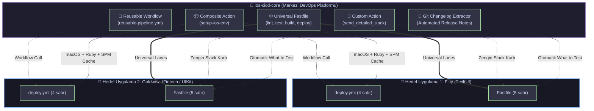

<div align="center">

# 🚀 iOS CI/CD Core
### **Enterprise-Grade, Modular & Plug-and-Play iOS DevOps Platform**

[](https://github.com/hakankorhasan/ios-cicd-core/tags)
[](https://fastlane.tools)
[](https://github.com/features/actions)
[](https://swift.org)
[](https://developer.apple.com/ios/)
[](LICENSE)

<br/>

<p align="center">
  <b>Tüm iOS projeleriniz için tek merkezden yönetilen, tek satır kodla dahil edilen ve sıfır kod tekrarı sunan yeni nesil CI/CD ekosistemi.</b>
  <br />
  <sub>Fitly gibi generative AI destekli modern SwiftUI projelerinden, Goldwise gibi gerçek zamanlı WebSockets kullanan UIKit tabanlı fintech uygulamalarına kadar tüm ekosistemde tam uyumlu.</sub>
</p>

[Mimarisi](#-mimari-tasarım-architecture) •
[Before vs. After](#-geleneksel-vs-core-mimari) •
[Özellikler](#-öne-çıkan-yetenekler) •
[Hızlı Başlangıç](#-tüketici-projeye-entegrasyon-sadece-5-satır) •
[Slack Önizleme](#-slack-bildirim-kartı-önizlemesi) •
[Lane Referansı](#-evrensel-lane-referans-tablosu)

---

</div>

## 💡 Neden `ios-cicd-core`?

Geleneksel mobil geliştirme süreçlerinde her yeni repo için onlarca satırlık `Fastfile` ve karmaşık `.github/workflows` YAML dosyaları kopyala-yapıştır yapılır. 
* Bir sertifika kuralı değiştiğinde **10 farklı repoyu tek tek gezmek** zorunda kalırsınız.
* Yeni bir projeye CI/CD kurmak saatler hatta günler sürer.
* Sürüm notları elle yazıldığı için tutarsızdır.

**`ios-cicd-core`**, **Platform Engineering / CI-CD as a Service** felsefesiyle bu teknik borcu ortadan kaldırır. Dağıtım motorunu bağımsız bir kütüphane haline getirir; hedef uygulamalar sadece birkaç satırla bu altyapıyı "import" eder.

---

## ⚡ Geleneksel vs. Core Mimari

| Metrik & Yetenek | Geleneksel Yaklaşım ❌ | `ios-cicd-core` Mimarisi ✅ | Kazanım 🚀 |
| :--- | :--- | :--- | :--- |
| **Yeni Proje Onboarding** | 2 - 4 Saat | **2 Dakika** | **%98 Zaman Tasarrufu** |
| **GitHub Actions Kod Yükü** | 80 - 120 satır YAML | **4 Satır** (`workflow_call`) | **Temiz & Standart CI** |
| **Bakım & Güncelleme** | Her repo için ayrı PR | **Tek Merkezden** (`ios-cicd-core`) | **Sıfır Bakım Maliyeti** |
| **Sürümleme Güvenliği** | Kontrolsüz scriptler | **SemVer Git Tagging** (`@v1.1.0`) | **Sıfır Kırılma Riski** |
| **Sürüm Notları (Changelog)** | Manuel / Unutulan notlar | **Otomatik Git Log Ayrıştırma** | **%100 Otomatize** |
| **Hata Bildirimi** | Ham konsol logları | **Block Kit Slack Kartı + Trace** | **Hızlı Kök Neden Tespiti** |
| **Performans Ölçümü** | Bilinmiyor | **Milisaniye Hassasiyetinde Süre** | **Build Benchmark Takibi** |

---

## 🏛️ Mimari Tasarım (Architecture)



---

## 💎 Öne Çıkan Yetenekler

### 1. 📝 Otomatik Changelog & Sürüm Notu Üretimi
Son Git commit geçmişini otomatik olarak analiz eder, yazar ve mesaj bilgilerini madde işaretlerine dönüştürür:
* **TestFlight:** *"What to Test"* açıklamasına anında enjekte edilir.
* **Slack:** Ekibe giden bildirim kartının altına *"🚀 Release Notes"* alanı olarak eklenir.

### 2. 🎯 GitHub Reusable Workflow (`workflow_call`)
Hedef projelerdeki karmaşık CI/CD scriptlerini tamamen ortadan kaldırır. Tek bir çağrıyla önbellekleri, Ruby/Bundler ortamını ve Fastlane iş akışlarını ayağa kaldırır.

### 3. ⏱️ Performans ve Süre Ölçümü (Benchmarking)
Her derleme adımının süresini milisaniye hassasiyetinde ölçer ve Slack raporuna `⏱️ Duration: 1m 24s` olarak yansıtır.

### 4. 🛡️ SwiftLint & Kod Kalite Kapısı (`universal_lint`)
Tüm pull request'lerde kod standartlarını otomatik denetler; derleme hatası veya stil ihlali olan PR'ların ana dala girmesini engeller.

### 5. 🔀 Hata Yakalama (Lifecycle Hook)
Pipeline herhangi bir adımda (`scan`, `gym`, `match`) patlarsa, `error do |lane, exception|` bloğu otomatik devreye girerek hatanın detayını, ilgili branch ve commit bilgisiyle kırmızı Slack kartı olarak yayınlar.

---

## 🔔 Slack Bildirim Kartı Önizlemesi

Build tamamlandığında veya hata aldığında Slack kanalınıza düşen **Block Kit** kartının canlı simülasyonu:

> ### 🟢 FitlyApp Pipeline Succeeded!
> 
> | Application | Status | Version | Duration | Branch | Commit |
> | :--- | :--- | :--- | :--- | :--- | :--- |
> | **FitlyApp** | ✅ **Success** | `1.0.0 (42)` | ⏱️ `1m 24s` | `main` | `e158d05` |
> 
> **🚀 Release Notes (What's New):**
> * • `feat`: Automated Changelog extraction directly from Git commits (*Hakan Körhasan*)
> * • `perf`: Multi-module Swift Package Manager build cache enabled (*Hakan Körhasan*)
> * • `fix`: Resolved code signing profile entitlement mismatch (*Hakan Körhasan*)

---

## 🔌 Tüketici Projeye Entegrasyon (Sadece 5 Satır!)

### 1. Hedef Projedeki `fastlane/Fastfile`:

```ruby
# encoding: utf-8
default_platform(:ios)

# 1. Merkezi repoyu Git üzerinden dahil et
import_from_git(
  url: "https://github.com/hakankorhasan/ios-cicd-core.git",
  branch: "main" # veya production güvenliği için tag: "v1.1.0"
)

platform :ios do
  desc "TestFlight Dağıtımı"
  lane :release do
    universal_testflight_deploy(
      scheme: "FitlyApp",
      bundle_id: "com.hakan.fitly",
      app_name: "Fitly"
    )
  end

  desc "Birim Testleri Koştur"
  lane :test do
    universal_test(scheme: "FitlyApp", device: "iPhone 17 Pro")
  end

  desc "Kod Kalite & Lint Kontrolü"
  lane :lint do
    universal_lint(scheme: "FitlyApp")
  end
end
```

### 2. Hedef Projedeki GitHub Actions (`.github/workflows/deploy.yml`):

```yaml
name: CI/CD Pipeline
on: [push]

jobs:
  pipeline:
    uses: hakankorhasan/ios-cicd-core/.github/workflows/reusable-pipeline.yml@v1.1.0
    with:
      scheme: 'FitlyApp'
      lane: 'test'
      device: 'iPhone 17 Pro'
    secrets:
      SLACK_WEBHOOK_URL: ${{ secrets.SLACK_WEBHOOK_URL }}
```

---

## 📖 Evrensel Lane Referans Tablosu

| Lane Adı | Parametreler | Açıklama |
| :--- | :--- | :--- |
| `universal_test` | `scheme`, `device`, `clean`, `code_coverage`, `output_directory` | `scan` ile birim ve UI testlerini simülatörde koşturur, coverage raporu üretir. |
| `universal_build` | `scheme`, `export_method`, `output_directory`, `configuration` | `gym` ile projeyi derler; development, ad-hoc, enterprise veya app-store çıktısı alır. |
| `universal_testflight_deploy` | `scheme`, `bundle_id`, `api_key_path`, `commit_count` | `match` ile sertifikaları çeker, derler, otomatik changelog üretir ve TestFlight'a yükler. |
| `universal_lint` | `scheme`, `strict`, `dry_run` | SwiftLint ve Swift sözdizimi doğrulaması yapar, PR kalitesini güvenceye alır. |
| `universal_mock_deploy` | `scheme`, `bundle_id`, `app_name`, `version`, `build` | Apple hesabı gerektirmeden pipeline akışını, changelog üretimini ve bildirimleri simüle eder. |

---

## 📁 Repository Klasör Hiyerarşisi

```text
ios-cicd-core/
├── .github/
│   ├── actions/
│   │   └── setup-ios-env/
│   │       └── action.yml           # 📦 Composite Action (macOS, Ruby, Bundler, SPM Cache)
│   └── workflows/
│       └── reusable-pipeline.yml    # 🎯 Reusable Workflow (workflow_call ana pipeline)
├── fastlane/
│   ├── Fastfile                     # ⚙️ Evrensel Dağıtım ve Test Motoru
│   └── actions/
│       └── send_detailed_slack.rb   # 🔔 Slack Block Kit Özel Eklentisi (Metrics + Changelog)
├── Gemfile                          # 💎 Sürüm kilitli Fastlane bağımlılığı
├── .gitignore                       # 🧹 iOS & Fastlane temizlik kuralları
└── README.md                        # 📖 Mimari Dokümantasyon & Entegrasyon Rehberi
```

---

## 👨‍💻 Yazar & İletişim

**Hakan Körhasan**  
*Senior iOS Developer & Mobile Architect*

[](https://www.linkedin.com/in/hakankorhasan/)
[](https://github.com/hakankorhasan)

---

<div align="center">
  <sub>Crafted with ❤️ for scalable, modern iOS engineering teams.</sub>
</div>
