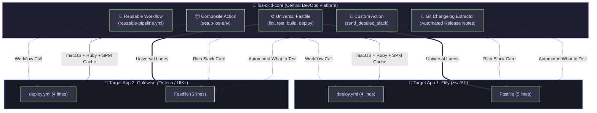

<div align="center">

# 🚀 iOS CI/CD Core
### **Enterprise-Grade, Modular & Plug-and-Play iOS DevOps Platform**

[](https://github.com/hakankorhasan/ios-cicd-core/tags)
[](https://fastlane.tools)
[](https://github.com/features/actions)
[](https://swift.org)
[](https://developer.apple.com/ios/)
[](LICENSE)

<br/>

<p align="center">
  <b>A centralized, zero-boilerplate, plug-and-play CI/CD ecosystem designed for iOS engineering teams.</b>
  <br />
  <sub>From modern generative AI-driven SwiftUI applications to real-time WebSocket fintech platforms, manage test automation, code signing, and TestFlight deployment with a single line of code.</sub>
</p>

[Architecture](#-architecture) •
[Before vs. After](#-traditional-vs-core-architecture) •
[Key Features](#-key-features) •
[Quickstart](#-quickstart-integration-just-5-lines) •
[Slack Preview](#-slack-notification-card-preview) •
[Lane Reference](#-universal-lane-reference-table)

---

</div>

## 💡 Why `ios-cicd-core`?

In traditional mobile engineering workflows, every new iOS repository duplicates dozens of lines of `Fastfile` scripts and bloated `.github/workflows` YAML files.
* When code signing rules or provisioning profiles rotate, **you are forced to manually update 10+ separate repositories**.
* Setting up CI/CD for a new application takes hours or days.
* Manually compiled release notes are inconsistent and prone to human error.

**`ios-cicd-core`** adopts a **Platform Engineering / CI-CD as a Service** philosophy. It encapsulates the entire delivery engine into a decoupled, versioned repository. Target apps simply "import" the core engine—eliminating technical debt and code duplication across your entire portfolio.

---

## ⚡ Traditional vs. Core Architecture

| Metric & Capability | Traditional Approach ❌ | `ios-cicd-core` Platform ✅ | Impact 🚀 |
| :--- | :--- | :--- | :--- |
| **New Project Onboarding** | 2 - 4 Hours (Copy-pasting scripts) | **2 Minutes** | **98% Time Saved** |
| **GitHub Actions Complexity** | 80 - 120 lines of repetitive YAML | **4 Lines** (`workflow_call`) | **Zero Boilerplate** |
| **Maintenance & Updates** | Separate PR per repository | **Single Source of Truth** (`ios-cicd-core`) | **Near-Zero Maintenance** |
| **Version Stability** | Untracked, unversioned scripts | **SemVer Git Tagging** (`@v1.1.0`) | **Guaranteed Stability** |
| **Release Notes (Changelog)** | Manual / often forgotten | **Automated Git Log Extraction** | **100% Automated** |
| **Failure Feedback** | Buried inside raw runner logs | **Block Kit Slack Cards + Stacktrace** | **Instant Root Cause** |
| **Benchmarking** | Unknown execution duration | **Sub-second Duration Metrics** | **Build Optimization Insights** |

---

## 🏛️ Architecture



---

## 💎 Key Features

### 1. 📝 Automated Changelog & Release Notes Extraction
Automatically inspects the latest Git commit log, parses commit messages and author metadata, and generates clean markdown bullet points:
* **TestFlight:** Dynamically populates the *"What to Test"* field during upload.
* **Slack:** Appends a formatted *"🚀 Release Notes"* block to team notifications.

### 2. 🎯 GitHub Reusable Workflow (`workflow_call`)
Eliminates hundreds of lines of repetitive CI workflow scripts. A single reusable workflow invocation handles runner provisioning, caching, dependency resolution, and Fastlane lane execution.

### 3. ⏱️ Duration Metrics & Benchmarking
Tracks the exact execution duration of each pipeline stage (`universal_lint`, `universal_test`, `universal_build`) and embeds timing metrics directly into Slack reports (`⏱️ Duration: 1m 24s`).

### 4. 🛡️ SwiftLint & Code Quality Gate (`universal_lint`)
Enforces code style and best practices across all pull requests, blocking builds with lint errors or broken syntax before merging.

### 5. 🔀 Lifecycle Error Trapping & Reporting
If any step fails (`scan`, `gym`, `match`), the `error do |lane, exception|` hook captures the exception and immediately posts an actionable red alert to Slack with the branch, commit SHA, and exact error message.

---

## 🔔 Slack Notification Card Preview

When a pipeline completes or encounters an error, the custom action renders a rich **Slack Block Kit** card:

> ### 🟢 FitlyApp Pipeline Succeeded!
> 
> | Application | Status | Version | Duration | Branch | Commit |
> | :--- | :--- | :--- | :--- | :--- | :--- |
> | **FitlyApp** | ✅ **Success** | `1.0.0 (42)` | ⏱️ `1m 24s` | `main` | `e158d05` |
> 
> **🚀 Release Notes (What's New):**
> * • `feat`: Automated Changelog extraction directly from Git commits (*Hakan Körhasan*)
> * • `perf`: Multi-module Swift Package Manager build cache enabled (*Hakan Körhasan*)
> * • `fix`: Resolved code signing profile entitlement mismatch (*Hakan Körhasan*)

---

## 🔌 Quickstart Integration (Just 5 Lines!)

### 1. Consumer App `fastlane/Fastfile`:

```ruby
# encoding: utf-8
default_platform(:ios)

# 1. Import the centralized core engine from Git
import_from_git(
  url: "https://github.com/hakankorhasan/ios-cicd-core.git",
  branch: "main" # or lock to tag: "v1.1.0" for production stability
)

platform :ios do
  desc "Release to TestFlight"
  lane :release do
    universal_testflight_deploy(
      scheme: "FitlyApp",
      bundle_id: "com.hakan.fitly",
      app_name: "Fitly"
    )
  end

  desc "Run Unit & UI Tests"
  lane :test do
    universal_test(scheme: "FitlyApp", device: "iPhone 17 Pro")
  end

  desc "Code Quality & Lint Check"
  lane :lint do
    universal_lint(scheme: "FitlyApp")
  end
end
```

### 2. Consumer App GitHub Actions (`.github/workflows/deploy.yml`):

```yaml
name: CI/CD Pipeline
on: [push]

jobs:
  pipeline:
    uses: hakankorhasan/ios-cicd-core/.github/workflows/reusable-pipeline.yml@v1.1.0
    with:
      scheme: 'FitlyApp'
      lane: 'test'
      device: 'iPhone 17 Pro'
    secrets:
      SLACK_WEBHOOK_URL: ${{ secrets.SLACK_WEBHOOK_URL }}
```

---

## 📖 Universal Lane Reference Table

| Lane | Key Parameters | Description |
| :--- | :--- | :--- |
| `universal_test` | `scheme`, `device`, `clean`, `code_coverage`, `output_directory` | Runs Unit & UI tests on simulator via `scan`, generates code coverage reports. |
| `universal_build` | `scheme`, `export_method`, `output_directory`, `configuration` | Builds and archives IPA via `gym` (development, ad-hoc, enterprise, app-store). |
| `universal_testflight_deploy` | `scheme`, `bundle_id`, `api_key_path`, `commit_count` | Fetches certs via `match`, archives IPA, auto-generates changelog, and uploads via `pilot`. |
| `universal_lint` | `scheme`, `strict`, `dry_run` | Runs SwiftLint / Swift syntax validation to maintain codebase standards. |
| `universal_mock_deploy` | `scheme`, `bundle_id`, `app_name`, `version`, `build` | End-to-end dry-run simulation without requiring live Apple Developer certificates. |

---

## 📁 Repository Structure

```text
ios-cicd-core/
├── .github/
│   ├── actions/
│   │   └── setup-ios-env/
│   │       └── action.yml           # 📦 Composite Action (macOS, Ruby, Bundler, SPM Cache)
│   └── workflows/
│       └── reusable-pipeline.yml    # 🎯 Reusable Workflow (workflow_call parent pipeline)
├── fastlane/
│   ├── Fastfile                     # ⚙️ Universal Delivery & Testing Engine
│   └── actions/
│       └── send_detailed_slack.rb   # 🔔 Slack Block Kit Custom Action (Metrics + Changelog)
├── Gemfile                          # 💎 Version-pinned Fastlane dependency
├── .gitignore                       # 🧹 iOS & Fastlane hygiene rules
└── README.md                        # 📖 Architecture Specification & Integration Guide
```

---

## 👨‍💻 Author & Connect

**Hakan Körhasan**  
*Senior iOS Developer & Mobile Architect*

[](https://hakankorhasan.com)
[](https://www.linkedin.com/in/hakan-korhasan-032721231/)
[](https://github.com/hakankorhasan)

---

<div align="center">
  <sub>Crafted with ❤️ for modern, scalable iOS engineering teams worldwide.</sub>
</div>
