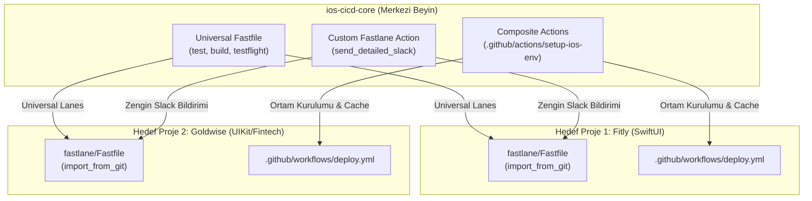

# 🚀 iOS CI/CD Core: Plug-and-Play Automation Ecosystem

[](https://fastlane.tools)
[](https://github.com/features/actions)
[](https://developer.apple.com/ios/)
[](#architecture)

> **Merkezi ve Modüler (Plug-and-Play) iOS CI/CD Servisi**  
> Tüm iOS projeleriniz için kod tekrarını önleyen, tek bir satırla içe aktarılabilen ve tek merkezden güncellenen kurumsal düzeyde dağıtım ve test mimarisi.

---

## 🏛️ Mimari Tasarım (Architecture)

Geleneksel yapılarda her iOS projesinde onlarca satırlık `Fastfile` ve `.github/workflows` dosyaları kopyala-yapıştır yapılır. `ios-cicd-core`, **Platform Engineering / CI-CD as a Service** yaklaşımı ile tüm DevOps operasyonlarını merkezi bir beyinde toplar.



---

## 📦 Katmanlar

### 1. GitHub Composite Actions (`setup-ios-env`)
macOS runner'lar üzerinde Ruby kurulumu, Bundler önbelleği ve Swift Package Manager (SPM) kütüphanelerinin önbelleklenmesini tek bir adımda çözer.

### 2. Evrensel Fastlane Dağıtım Motoru (`Fastfile`)
Hiçbir projeye (bundle ID veya scheme) hardcoded bağımlılığı yoktur. Parametrelerle beslenir:
* `universal_test`: `scan` ile birim ve UI testlerini simülatörde koşturur, kod kapsamı (coverage) raporlar.
* `universal_build`: `gym` ile projeyi derler; development, ad-hoc veya enterprise formatında çıktılar üretir.
* `universal_testflight_deploy`: `match` ile sertifikaları çeker, `gym` ile archive alır ve `pilot` ile TestFlight'a yükler.
* `universal_mock_deploy`: Gerçek Apple Developer sertifikası olmadan tüm hattı test edebilmeniz için simülasyon modu.

### 3. Özel Fastlane Eklentisi (`send_detailed_slack`)
Slack Block Kit API'sini kullanarak derleme durumu, versiyon, build numarası, branch, commit SHA ve hata mesajlarını içeren kurumsal düzeyde bildirim kartları üretir. Webhook yoksa otomatik olarak **Dry-Run** moduna geçerek konsola renkli önizleme basar.

---

## 🔌 Tüketici Projeye Entegrasyon (Sadece 5 Satır!)

Herhangi bir iOS projenizin (örneğin `Fitly` veya `Goldwise`) `fastlane/Fastfile` dosyasına yalnızca şunu yazmanız yeterlidir:

```ruby
default_platform(:ios)

# 1. Merkezi repoyu Git üzerinden dahil et
import_from_git(
  url: "https://github.com/hakankorhasan/ios-cicd-core.git",
  branch: "main" # veya production için tag: "v1.0.0"
)

platform :ios do
  desc "TestFlight Dağıtımı"
  lane :release do
    universal_testflight_deploy(
      scheme: "Fitly",
      bundle_id: "com.hakan.fitly",
      app_name: "Fitly App"
    )
  end

  desc "Test Koşumu"
  lane :test do
    universal_test(
      scheme: "Fitly",
      device: "iPhone 16"
    )
  end
end
```

### GitHub Actions Entegrasyonu (`.github/workflows/deploy.yml`):

```yaml
name: CI/CD Pipeline

on:
  push:
    branches: [ main ]

jobs:
  deploy:
    runs-on: macos-latest
    steps:
      - name: Checkout
        uses: actions/checkout@v4

      # Merkezi ortam kurulum eklentisini çağır
      - name: Setup Core iOS Environment
        uses: hakankorhasan/ios-cicd-core/.github/actions/setup-ios-env@main

      # Fastlane lane'ini tetikle
      - name: Deploy to TestFlight
        run: bundle exec fastlane release
        env:
          MATCH_PASSWORD: ${{ secrets.MATCH_PASSWORD }}
          SLACK_WEBHOOK_URL: ${{ secrets.SLACK_WEBHOOK_URL }}
```

---

## 🧪 Yerel Olarak Test Etme

Core repoyu kendi makinenizde test etmek için:

```bash
# 1. Custom Action'ı test et (Dry-Run ile)
fastlane run send_detailed_slack app_name:"Fitly" status:"Success" version_number:"1.2.0" build_number:"42" dry_run:true

# 2. Mock Deploy akışını çalıştır
fastlane universal_mock_deploy app_name:"Fitly" scheme:"FitlyApp" bundle_id:"com.hakan.fitly"
```

---

## 🌟 Neden Bu Mimari? (Key Highlights)

1. **Single Source of Truth (Tek Doğru Kaynağı):** Dağıtım kuralları değiştiğinde 10 ayrı uygulamanın reposunu güncellemek yerine yalnızca `ios-cicd-core` güncellenir.
2. **Zero-Friction Onboarding:** Yeni bir iOS projesi dakikalar içinde CI/CD'ye hazır hale gelir.
3. **Separation of Concerns:** iOS uygulama geliştiricileri sadece ürün koduna odaklanır; DevOps karmaşası soyutlanır.
