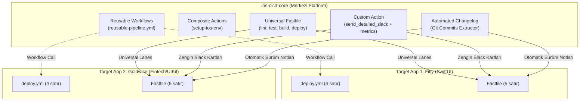

# 🚀 iOS CI/CD Core: Plug-and-Play Automation Platform

[](https://fastlane.tools)
[](https://github.com/features/actions)
[](https://developer.apple.com/ios/)
[](https://swift.org)
[](#architecture)

> **Enterprise-Grade, Zero-Friction iOS CI/CD as a Service**  
> Tüm iOS projelerinizi (SwiftUI, UIKit, Multi-module) tek merkezden yönetin. Kod tekrarını sıfırlayın, TestFlight dağıtımlarını, otomatik Changelog üretimini ve Slack bildirimlerini **tek bir satır kodla** projelerinize dahil edin.

---

## ⚡ Geleneksel vs. Core Mimari (Before vs. After)

| Özellik | Geleneksel Yaklaşım ❌ | `ios-cicd-core` Mimarisi ✅ |
| :--- | :--- | :--- |
| **Yeni Proje Kurulumu** | 2-4 saat (Fastfile & GHA kopyala-yapıştır) | **2 Dakika** (`import_from_git` + 5 satır) |
| **Bakım Maliyeti** | 1 kural değiştiğinde 10 repo güncelleme | **Tek Noktadan** (Sadece `ios-cicd-core` güncellenir) |
| **Sürümleme & Güvenlik** | Takipsiz ve kontrolsüz scriptler | **SemVer Git Tags** (`@v1.0.0`) ile kırılma koruması |
| **Sürüm Notları (Changelog)** | Elle yazılan tutarsız notlar | **Otomatik Git Log Ayrıştırma** (TestFlight & Slack) |
| **Hata Yönetimi** | Terminal loglarında kaybolan hatalar | **Block Kit Slack Kartı** (Commit, Branch, Duration, Trace) |
| **Derleme Süresi Takibi** | Bilinmeyen gecikmeler | **Otomatik Süre Ölçümü** (`⏱️ Build Time: 1m 24s`) |

---

## 🏛️ Mimari Tasarım (Architecture)



---

## 💎 Öne Çıkan Yetenekler (Core Features)

### 1. 📝 Otomatik Changelog & Release Notes Üretimi
Son Git commit geçmişini otomatik olarak analiz eder, madde işaretlerine dönüştürür ve:
* TestFlight'ın *"What to Test"* açıklamasına otomatik basar.
* Slack bildirim kartına *"🚀 Release Notes"* alanı olarak ekler.

### 2. ⏱️ Performans ve Süre Ölçümü (Benchmarking)
Her pipeline adımının (`universal_lint`, `universal_test`, `universal_build`) başlangıç ve bitiş zamanını milisaniye hassasiyetinde takip eder ve Slack raporuna `⏱️ 1m 35s` şeklinde iliştirir.

### 3. 🎯 GitHub Reusable Workflow (`workflow_call`)
Hedef projelerdeki karmaşık YAML dosyalarını tarihe gömer. Tek bir çağrıyla tüm ortam kurulumunu, önbellekleri ve derleme adımlarını yürütür.

### 4. 🛡️ SwiftLint & Kod Kalitesi Geçidi (`universal_lint`)
Tüm PR'larda kod standartlarını denetler, ihlal durumunda pipeline'ı güvenle durdurur.

---

## 🔌 Tüketici Projeye Entegrasyon

### 1. `fastlane/Fastfile` (Sadece 5 Satır!)

```ruby
# encoding: utf-8
default_platform(:ios)

# Merkezi repoyu Git üzerinden dahil et
import_from_git(
  url: "https://github.com/hakankorhasan/ios-cicd-core.git",
  branch: "main" # veya production için tag: "v1.0.0"
)

platform :ios do
  desc "TestFlight Dağıtımı"
  lane :release do
    universal_testflight_deploy(
      scheme: "Fitly",
      bundle_id: "com.hakan.fitly",
      app_name: "Fitly"
    )
  end

  desc "Test Koşumu"
  lane :test do
    universal_test(scheme: "Fitly")
  end
end
```

### 2. GitHub Actions (`.github/workflows/ci.yml` - Sadece 4 Satır!)

```yaml
name: CI/CD Pipeline
on: [push]

jobs:
  build:
    uses: hakankorhasan/ios-cicd-core/.github/workflows/reusable-pipeline.yml@v1.0.0
    with:
      scheme: 'Fitly'
      lane: 'test'
    secrets:
      SLACK_WEBHOOK_URL: ${{ secrets.SLACK_WEBHOOK_URL }}
```

---

## 🧪 Yerel Simülasyon ve Test

Apple Developer ücretli sertifikası gerekmeden tüm sistemi yerel ortamda test etmek için:

```bash
# 1. SwiftLint & Kod Kalite Kontrolü
fastlane universal_lint scheme:"Fitly"

# 2. Otomatik Changelog & Süre Takibi ile Mock Dağıtım
fastlane universal_mock_deploy app_name:"Fitly" scheme:"FitlyApp" bundle_id:"com.hakan.fitly"
```
